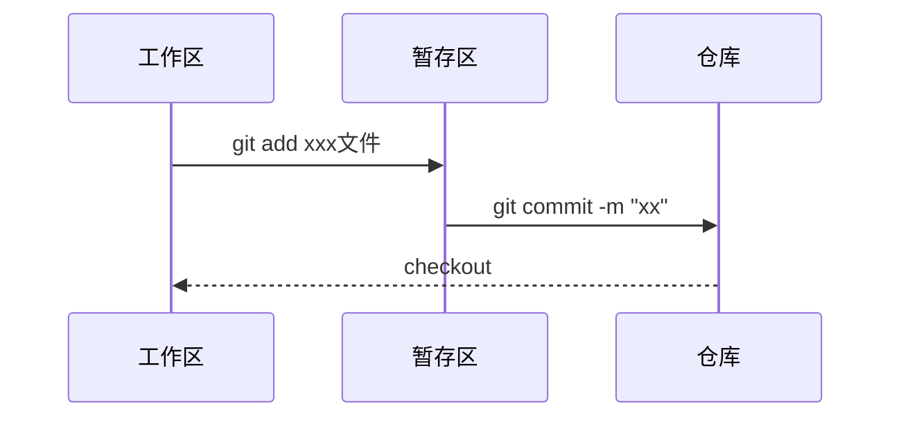
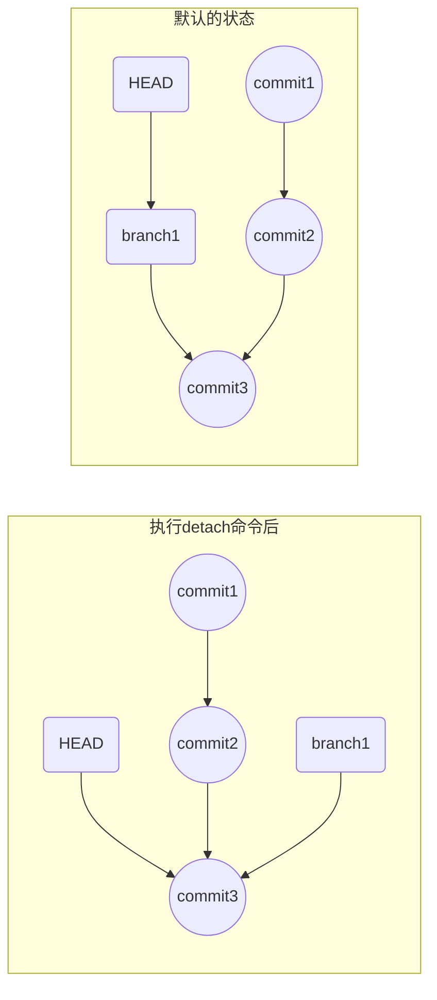

# 背景

版本控制系统`VCS(Version Control System)`，是一种用于管理控制代码版本的工具系统，通过该种系统能够实现对代码的追踪维护等功能。目前在使用的主流系统中，主要有以下两种

#### 集中化的版本控制系统(Centralized Version Control Systems，简称 CVCS)

该类系统的主要的运作流程是，由单一的服务器承担中央仓库的角色，保存代码修订的所有版本及记录。然后各个协同人员通过拉取和推送代码进行协作开发，协同人员本地只需要留存需要修改的指定代码版本。这种做法对于早期靠着本地数据库维护的代码版本控制系统来说，管理员能更加清晰的了解到协同开发人员每次的修改及对他们的权限控制。当然，这样的系统也是存在一些致命的弱点的，单一的服务器作为最主要的角色，一旦出现了问题，那么所有连接服务器的客户端都无法提交或者更新代码，如果更严重一些，服务器的磁盘出了问题，整个工程的代码及代码历史都会丢失。国内一般使用是的 `SVN`，现在依然有一些企业使用的是这种管理工具

#### 分布化的版本控制系统(Distributed Version Control System，简称 DVCS)

为了解决集中化的版本控制系统所存在的隐患问题，分布式的版本控制系统就面世了，如`Git、Mercurial、Bazaar 以及 Darcs`等。其最明显与集中化系统的区别就是，在分布式的系统中，每一个客户端都保存有完整的修订历史记录的快照。这样每次代码修改的操作，都是其他客户端进行了一些代码仓库快照的备份，当某一个仓库出现问题时，可以通过其他仓库的完整记录来进行恢复。这里可能有一个疑问，就是每个客户端都保存有完整的修改历史仓库，那每一份仓库会不会都很大，对各个协同的人员来说，同步与备份或者本地的存储等有一定的压力。事实上，除去资源文件，代码的修订记录的大小是很可观的，同时，`git`中也针对这些进行了一定的优化，在同步与本地的存储上，实际使用的体验的还是很可观的。所以，如果项目中的资源文件较大时，依然可以考虑使用中央式的版本控制系统来进行管理。

# 基本概念

一般来说，开始使用`git`的场景分为从远程服务器克隆已存在的项目和开始新项目，初始化仓库。前者直接使用`git clone XXXXX(远程仓库地址)`就可以将远端的仓库完整的拷贝到本地。


不过从头开始初始化一个本地仓库，更容易去理解`git `的工作流程。命令`git init`可以将一个文件目录初始化为一个仓库， `git`会相应的生成一个`.git`的文件夹，这个文件夹就是 **本地仓库（Local Repository）**，这个文件夹中就会保存该目录中**之后**所有文件的改动记录，而这个目录在`git`中就被称为`工作区(Working Directory)`。


除了`工作区`以外，`git`中还有`暂存区`。(注意：这里我是新建了一个文件夹，进行的初始化操作，如果新建的文件夹是刚刚克隆的`git`目录中，在已存在的仓库中再次`git init`一个仓库会不会有什么问题，答案是并不会，`git`中使用的是目录管理而不是设备管理，一个仓库只会对应的管理其对应的目录，不会相互影响)


如上图，是`git`的一个基本的工作流程：当我们在工作区域中修改了某个文件的文件内容时，`git`会自动检测到这种改动并进行了标记，然后需要我们手动的将这些改动添加(使用命令  `git add`)到暂存区中，这样我们所修改的东西就会被`git`记录下来，而没有添加到暂存区的改动在进行各种`git`命令时可能会丢失。如果我们确定了暂存区中的内容是这样的修改，就可以将暂存区的改动记录进行提交，那么这次修改的内容就会从暂存区迁移到仓库中，并在仓库中生成一个提交记录--`commit`。整个仓库中，所有的改动记录就是有一个一个的`commit`串行所构成的。

以下就是文件在不同的区域的一个时序图：



回到我们刚刚克隆的仓库中，使用命令`git log`可以查看当前仓库的一些日志。


分析图中出现的数据，就衍生出来 `git` 中的几个重要的概念：

#### 引用

简单来说，`git`中的引用就是指向某个`commit`的快捷方式，我们通过操作引用能够快速的操作到某个具体的`commit`，可以看到上图中红圈中的内容，记录中显示，远端仓库只有一次`commit`，该`commit`的后面跟着一串字符串，这个字符串是根据该`commit`计算出来的`SHA-1`值(一种算法计算出来的值，两个 `commit` 计算出来的值很少能重复)，`commit`将其作为唯一的标识。大多数时候，我们需要操作具体的某个`commit`时，可以直接使用该值的前几位来代表这个`commit`，如

```shell
git checkout dab6cd
```

 上面这个命令就会签出`dab6cd`这个`commit`。

#### HEAD

这个引用比较特殊，它指的是**指向当前`commit`的引用**，当我们从远端仓库拉取代码时或者`checkout`新的分支时，`HEAD`指向会随着我们的操作相应的修改，使得它始终指向的是当前**工作区**中对应的`commit`。

#### master

这个是`git`在创建时，默认生成的一个分支。大多数工程都将该分支作为主分支使用，在开发时，建立其他分支来开发工作，最后将完善的功能合并到主分支中。上图中的`origin/master, origin/HEAD`代表的是远程仓库的`master`分支最新的`commit`和远程仓库的`HEAD`指向的`commit`都是`dab6cd`，值得一提的是，无论本地的`HEAD`如何修改，远程仓库中的`HEAD`永远指向的是`master`分支。

#### branch

分支，既然有默认的分支，那也代表我们可以创建其他分支。其实，在整个`git`仓库中，是由一个个的分支构成，而分支由一个个的`commit`构成。形象一点说就是`git`仓库像一颗大树，`master`分支就是大树成长时的主干，慢慢随着长大，出现了许多的树枝，这些树枝就是我们自己新建的`branch`，而树枝上的树叶就是一个个`commit`。

当`HEAD`指向某个`branch`时，其实**间接的**是指向这个`branch`的某个`commit`(之所以说是间接的指向，是因为这种情况下的`HEAD`还是直接指向的`branch`，而`branch`指向的是它最新的`commit`，这样构成了间接的指向。还有直接的指向，就是使用`git checkout --detach`命令后，`HEAD`就会由指向`branch`变成指向`commit`)。如下所示



`git checkout xxx`这个命令翻译为 签出，使用该命令签出某个`commit`时，工作区的内容会替换为该`commit`，并同时将 HEAD 引用指向该`commit`，当签出命令为某个分支时，会签出该分支的最新的那个`commit`

`branch`的构成是一条从起始`commit`到该`branch`最新的`commit`的一条路径，它所包含的信息就是这条`commit`链上所有的`commit`。

# 基本流程中的操作

### 完整流程

假设我们已经将文件改动好了，可以使用`git status`命令来查看当前的一些状态


可以看到`git`对修改的文件进行了标识，显示为红色的 `modified`，红色的意思是代表这些改动还没有被添加到暂存区中，也就是处于一种被标记了，但是没有被记录的状态。

然后执行`git add .`，将修改添加到暂存区中，再次查看


可以看到刚刚的红色变成了绿色，这表示已经添加到了暂存区中。

最后使用`git commit -m "本次提交的描述"`命令可以将暂存区中的改动记录提交到仓库中


通过上图可以看到，现在仓库中存在两条`commit`记录，`HEAD`也指向了刚刚提交的最新的`commit`,而远端依然指向的是克隆时的`commit`，因为没有人提交了`commit`到远端。

现在，可以将刚刚的改动提交到远端，但是正常情况下，我们其实并不知道远端是否有新的改动，所以一个比较保险的做法，先进行一次拉取操作`git pull`，这样如果远端有人提交了改动，我们就能先拉取合并。再把最后合并和的提交一起推到远端仓库。


现在再查看下本地的状态，可以看到，远端的`HEAD`也指向了最新`commit`


这算是一次比较顺利的工作流程，从本地修改文件，然后提交记录，再推送到远端进行了合并，以方便其他同事拉取你的修改。但是大多数情况下，并不会这么顺利，会产生比较多的冲突。

###关于CLONE

当我们使用`git clone`的命令时，`git `首先是将远程仓库的快照下载到本地。然后根据快照中的分支和`commit`去下载对应的`commit`。然后`git `会从第一个起点的`commit`开始，一个一个的应用`commit`链上的`commit`到工作区中，直到最新的那个`commit`被应用上。

### 关于 ADD

刚刚的流程中使用了`add`命令，我使用的是`git add .`后面跟了一个`.`这个的意思是，**全部暂存**。如果你不想全部暂存，就需要把`.`替换成需要暂存的**文件名**。

我们在工作区中，新增的文件，默认是不会被`git`所追踪的，也就说文件中任何的改动是不被`git`检测记录的。需要使用`git add`命令将文件添加，这样`git`才会开始追踪，所以新增一个文件时，使用`add`命令的含义其实有两层，一个将这个文件的新增作为工作区中的一种形式的改动，提交到`git`仓库中，第二层就是让文件被`git`所追踪。其他时候，当我们做出一些修改的时候，需要添加到暂存区中，也是使用此命令。

需要注意的一点是，`git`中所记录的是文件内容的改动，而非文件本身，所以当添加了一次文件的修改后，又修改了相同文件的内容，还需要再添加一次刚刚的修改。如下操作：

```shell
# 改动了文本的内容
vim xxx.txt
# 添加到暂存区
git add . 
# 再次改动文本的内容
vim xxx.txt
# 注意这里还需要添加刚刚改动的内容到暂存区中
git add .
# 这样两次改动才会都被仓库记录
```

### 关于 PULL

`git pull`操作其实就做了两件事，先将远端的`commits`拉取到本地，然后进行一次合并操作

### 关于 PUSH

刚刚的操作中，使用`git push`就将`master`分支上新的`commit`推到了远端仓库，与远端仓库的`master`分支进行了合并。这其实是一种粗略的说法，一笔带过了。

`git push ` 会将默认分支的本地提交记录上传到远程分支上进行合并，如果不指定的话，所更新的分支为`git config 中的 push.default的值对应的分支，这个值默认为:current `  其中的值`git config` 命令来进行修改， 进而改变 push 时的行为，详情查看[git config](https://git-scm.com/docs/git-config#git-config-pushdefault)。如果需要提交记录的分支不是默认的分支，需要在命令中添加几个新的参数

```shell
git push origin target_feature
```

那么这次的 push 会推向远程分支的`target_feature`分支

**注意：push 时不会上传 HEAD 的指向，远程分支的 HEAD 永远指向的是 `master` ** 

# 分支相关的操作

### 分支的创建和删除

1. 创建 `branch` 的方式是 `git branch 名称` 或 `git checkout -b 名称`（创建后自动切换）；
2. 切换的方式是 `git checkout 名称`；
3. 删除的方式是 `git branch -d 名称`。

### 分支的合并 Merge

多数情况下，我们需要将不同的分支的代码进行合并，那么就需要使用到`git merge`命令，该命令具体做的事情是：**从目标 `commit` 和当前 `commit` （即 `HEAD` 所指向的 `commit`）分叉的位置起，把目标 `commit` 的路径上的所有 `commit` 的内容一并应用到当前 `commit`，然后自动生成一个新的 `commit`。**

在合并时，最舒服的状态就是，新的分支的改动是领先于合并的分支的，这时候只需要将新分支的`commits`直接移过来，就完成了一次合并，在`git`中被叫做`fast-forward`。不过大多数时候，还是不那么舒服的。

#### 解决冲突

首先我们需要切换到`branch1`分支，对`README.md`文件进行修改。并按照流程进行了提交。

然后切换回`master`分支，同样的对`README.md`文件进行了修改，也进行了提交。

那么这个时候，同一文件，在不同的分支上都进行了改动，对于`git` 而言，可以分为良性情况和恶性情况(`git`中没有这个定义，只是为了理解)。什么是良性的呢，就是两次改动的地方不一样，比如有5行文本，`branch1`分支中改下了第4行，而`master`分支中修改了第3行，这样`git`就能知道两个分支改的东西不一样，就能自动合并，最后新生成的`commit`就是第3行和第4行都被修改了。对应来说，恶性的就是两个分支的改动，改了同一处地方，`git`并不知道哪个分支的改动才是我们想要的，所以最后的决定权交到了我们自己手里，这个时候就需要手动的处理冲突。

在`git`中，对于这种冲突，会做一些明显的标识如下

```
>>>>>>> HEAD
第4行内容master分支的修改
=========
第4行内容 branch1分支的修改
>>>>>>>> branch1
```

这个很容易理解，上面的内容是`HEAD`所在的`master`分支的修改，下面的是`branch1`分支的修改，我们根据具体的需求进行修改，删除`git`自动生成的`>>>>>`和`======`。这算一次新的改动了，所以需要再次进行`add .`和`commit`。


可以看到，这个过程中一共生成了3个`commit`。

#### 不解决冲突

上诉的操作代表正常处理了一次冲突，如果不需要处理，想要放弃。可以使用以下命令

```shell
git merge --abort	
```

之后便回到 `merge` 前的状态。如图所示，在合并时，产生了冲突`both modified: README.md`，执行命令后，状态回到了`master`合并之前。


# 进阶操作

> 注意：进阶操作中的命令，请先在自己的 DEMO 中多次练习熟悉后，再在实际的工程中使用，某些命令一旦出错，请千万不要 Push 到远程分支，哪怕丢弃掉本地所有的修改。
>
> **在操作本地的 commit 时，需要考虑对远端分支的影响，尤其是多人协同的分支**
>
> **禁止使用 rebase 命令对任何已经提交到远程分支的 commit 进行操作**

### 仅合并少数几个 commit

在实际工作开发中，会遵循标准的 Git Work flow，对待不同的功能，会切出不同的分支进行 coding，所以，基于什么基准分支切出来的功能分支进行 coding，这是一个很重要的问题。

如果切错了基准分支，你会发现可能最终开发完成之后， merge 不回去了。或者需要将某个分支上的 commit 代码，移植到某个分支上面，就需要使用到 cherry-pick 这个 git 命令了。

这个命令的用法如下，

```shell
git cherry-pick -x <commit_id>
```

其中`-x`的参数代表保留原提交者的信息，后面的`<commit_id>`的写法就是`<start-commit-id>…<end-commit-id>`这个代表一个从`startCommitId`到`endCommitId`的一个左开右闭的区别`(startId, endId]`，如果需要包含`startId`可以添加一个符号`<start-commit-id>^…<end-commit-id>`这样就是`[startId,endID]`的一个闭区间了。

提交的记录可以通过`git log --pretty=oneline`来查看。


然后查看`master`分支的`commit`会发现刚刚合并的已经有了。

合并过程中，如果出现了冲突，就和普通冲突一样，手动的解决，然后添加提交，再执行`git cherry-pick --continue`就可以继续了，直到合并完成。

参考文章：[Cherry-Pick | 一日一 Git](https://juejin.im/post/5925a2d9a22b9d0058b0fd9b)

### rebase 与 merge

`rebase`的直译是改变基点，其实这个指令的功能也差不多是这个意思。那我们看看这个命令的具体使用及应用场景。

通过上面的命令，可以知道在执行`merge`操作时，会生成一个新的`commit`，同时整个历史记录上也会保留合并的痕迹(`branch1`会与`master`形成一个回路的形式)，这样对代码的历史并不是线性的，看起来不是很直观。

```
1-->2-->3-->4-->5-->6   master
		 \				 /
		 	7-->8-->9          branch1
```


那么使用`rebase`命令的效果是什么样的呢。

首先，我们需要**切换分支到`branch1`分支上使用`rebase`命令 **，这一点需要注意，就是在哪个分支执行这个命令。

```shell
git checkout branch1
git rebase master
```


上面的命令执行之后，`git`所做的事如上图所示，切换分支后，`HEAD`指向移动到了 `branch1`分支的最新`commit`上，然后执行`git rebase master`，这个命令会将从`master`分支与`branch1`交叉开始之后的`commits`的基点都修改到`master`分支上，并移动`branch1`和`HEAD`的指向，但是需要注意的是，这个操作完成之后，在`master`上的`7、8`的`commit`和之前的`5、6`仅仅是内容相同，本质上依然属于两个不同的`commit`。这样操作就完了么？并没有，还需要回到`master`分支，执行一次`merge`，因为刚刚的操作结果仅仅是将`branch1`分支的`commit`接在了`master`上，而`master`的指向依然是之前的`commit`，所以这里的操作相当于执行了一次`fast-forward`。

```shell
git checkout master
git merge branch1
```


这样，整个过程才算完成了。这样看起来好像比直接`merge`的操作要复杂很多，那么它的意义在哪儿呢，这个就得看具体的需求了，关于`rebase 和 merge`更深入的理解可以参考文章[rebase 和 merge 详解](https://www.cnblogs.com/kidsitcn/p/5339382.html)。

熟悉了理论后，根据上面的知识点进行一次实际的操作来加深理解。

同样的，现在在`master`分支和`branch1`分支上都进行了修改，那么我们现在处于`branch1`分支中，执行`rebase`命令。


在`branch1`中的最新`commit`是`这是 branch1上的第二次提交`，在`rebase`过程中和`master`最新的`commit`产生了冲突，这个时候手动的编辑文件，解决冲突。使用`add .`命令将合并后的改动添加到暂存区。然后，和`merge`不一样的操作就是，这里需要执行不是`git commit`而是`git rebase --continue`，同理，如果需要放弃，也可以使用`git rebase --abort`，这里细看其实上面的命令描述中都有提示。我们解决了冲突，那就执行继续的命令。


第一步完成后，查看`branch1`上的提交，可以看到，最新的`commit`后面是`master`的`commit`，所以这里的实际情况和上面的动图有一些不一样在于，这一步之后，`branch1`上的`commits`就已经变成了整合了 `master`上的`commit`的一个分支，现在的`branch1`已经是拥有了两个分支完整的`commit`了。但是，我们需要的是`master`分支更完整。

```
# 执行前 master 和 branch1的情况
1-->2-->3-->4-->5-->6  master
		 \
		 	7-->8-->9        branch1
# 执行完 rebase 后 mater 和 branch1的情况
1-->2-->3-->4-->5-->6  master
		 \
		 	3-->4-->5-->6-->7-->8-->9        branch1
```

现在回到`master`分支，再执行`merge`命令就可以理解为什么是一次`fast-forward`了。最后的结果如下:


### 修正已提交的 Commit

#### 修正最新的 commit

如果是最新提交的`commit`被发现有问题，`git`中提供了直接的命令可以修改`git commit --amend`。

如何使用呢，假设现在已经有一个最新的提交`1`，我们发现其中有几个地方写错了，那就进行修改，然后一如既往的`add`，现在我们需要不是把这个新提交一个`commit`，而是修改，所以现在就不是使用`git commit -m "xxx"`而是`git commit --amend`，


这个时候会出现一个信息编辑界面，显示着最新的`commit`的信息，点击`i`进入编辑模式，修改提交的`message`，然后退出保存即可，再调用`git log`可以看到最新的`commit`已经被改了。

这里有一点需要注意的是，最新的`commit`并不是被直接修改，而是被**替换**掉了，`git commit --amend`会生成一个新的`commit` 来替换最新的那个`commit`，在`git`中，每一个已经提交的`commit`都是无法被修改的，我们的操作只是基于一条`commit`链进行替换、复制和删除等等，仅仅是取消了对`commit`的引用和链接。

#### 修改不是最新的 commit

当需要改正的`commit`不是最新的那个，上面的方法就不太适用了。这个时候需要用的是`rebase -i `命令(`rebase --interactive`交互式`rebase`的缩写)，这也是`rebase`命令的另一个比较常见的适用场景。

现在，我们假设如图的`commit`有了错误的提交。首先使用以下命令，将`HEAD`指向移动到当前`commit`的后面3个`commit`。


```shell
git rebase -i HEAD~3
```

> 说明：在 Git 中，有两个「偏移符号」： `^` 和 `~`。
>
> `^` 的用法：在 `commit` 的后面加一个或多个 `^` 号，可以把 `commit` 往回偏移，偏移的数量是 `^` 的数量。例如：`master^` 表示 `master` 指向的 `commit` 之前的那个 `commit`； `HEAD^^` 表示 `HEAD` 所指向的 `commit` 往前数两个 `commit`。
>
> `~` 的用法：在 `commit` 的后面加上 `~` 号和一个数，可以把 `commit` 往回偏移，偏移的数量是 `~` 号后面的数。例如：`HEAD~5` 表示 `HEAD` 指向的 `commit`往前数 5 个 `commit`。

会出现下图界面


根据提示，进入编辑模式，在我们需要修改的`commit`前，将`pick`修改为`edit`模式。`edit`模式的意思就是应用当前的`commit`并修正。

之后退出保存，这个时候，当前的工作区中就是我们需要修改的这个`commit`了，和上面修改最新的`commit`一样，改动当前`commit`的内容并使用`git commit --amend`进行修正。完成后，`git rebase --continue`。


从结果上看，我们需要修正的那个`commit`已经被替换修改了。

#### 丢弃 commit

 1.丢弃最新的 commit

当我们因为各种原因，导致最新的`commit`不再是我们想要的那个`commit`的时候，怎么去撤销它呢

```shell
git reset --hard HEAD^
```

这个命令可以将最新的`commit`从分支中移除掉，这样最新的`commit`就是之前的`commit`的前一条，其中几个参数说明下：

`--hard`这个参数主要使用的有三个值分别是`hard、soft和 mixed`，区别在于。使用`--soft`模式，会修改版本库中的记录(从`branch`中移除该`commit`)，但是会保留`暂存区`和`工作区`，也就是将本地版本库的头指针全部重置到指定版本，且将这次提交之后的所有变更都移动到暂存区。使用`--hard`模式，三者都会被重置，一定需要注意。 而不加参数时，默认使用的是`--mixed`，这种模式下是，保留工作区，清除暂存区。

这里再讨论下更复杂的一种情况，那就是如果我丢弃的内容中，有一部分是想要的或者我还需要对照着查看。可以分为三种情况：

- 已经 `commit`了，这种其实是最常见的一种情况，因为有`SHA-1`值，可以使用`git reflog`来查看我们操作的历史，找到刚刚`commit`的`SHA-1`值就可以找到被丢弃的那个`commit`。(需要注意的一点是，对于没有引用的`commit`，`git`会在一定时间内进行自动清理)
- 还没有`commit`，但是 添加到了暂存区中。这个就麻烦一些了，因为没有生成对应的`SHA-1`值，无法通过第一种情况的方法找到，就需要使用另一个的命令`git fsck --lost-found`操作，如果返回成功的结果，我们就可以在`.git/lost-found/`目录中找到刚刚丢弃的文件。
- 连暂存区都没有添加到，这种情况下，只能靠**IDE**的本地历史记录来寻找了。

参考文章：[Git reset 后的数据恢复操作](https://juejin.im/post/5af0438f5188251b8015967e)

其实，对于`reset`命令来说，它的本质是**移动 HEAD 以及它所指向的 branch**，撤销对其只是在本质上附带开发的一种功能而已。但是这一点上好像和`checkout`命令有点相似，区别是`checkout`没有改变所指向的`branch`，是的，这确实是他们最大的区别，使用`checkout`命令签出某个`branch`（前面也说过，对于工作区来说这其实也是签出某个`commit`，但是在指向中，是有区别的，一个是指向了`branch`，一个是指向了`commit`）或者`commit`时，它所改变的仅仅是`HEAD`的指向。所以这里，还有一种命令

```shell
git checkout --detach
```

这行命令的效果就是，仅仅让`HEAD`脱离了指向`branch`，而直接指向了`commit`。

2. 丢弃不是最新的 commit

   这个需求有两种命令可以实现：

   - 这个从理论上来说，本质上和修改不是最新的 `commit`是一样的。使用`git rebase -i `的命令，查看需要修改的几个`commit`，和修改不一样的在于，修改时我们是修改`pick`为`edit`。这里现在有两种做法，一个是将需要丢弃的 `commit`那行直接删除，这样在`rebase`命令执行过程中就会过滤掉被删除那行的`commit`，还有一种更标准的做法就是将`pick`修改为`drop`。最后再执行`git rebase --continue`即可。关于`drop`和删除一行的讨论，在[科学传送门](https://stackoverflow.com/questions/35846154/git-rebase-interactive-drop-vs-deleting-the-commit-line)这里有一些讨论可以参考。

   - 使用`git rebase --onto`命令

     在使用`git rebase`命令时，`git`会自动的选取起点，这个起点选取的方法就是当前的`commit`和目标的`commit`在历史记录上的交叉点作为起点（上面使用`rebase`命令的时候，都是如此）。而给`rebase`命令添加了`--onto`参数后，就可以指定起点。假如现在有如下的提交记录。

     ```
     a-->b-->c-->d    master
          \
          	e-->f-->g  branch1
     ```

     需求上，在合并`branch1`时，只需要合并`f, g`两个`commit`，就可以这样使用

     ```
     git rebase --onto d e branch1
     ```

     注意，`rebase`命令在执行时，会排除起点的`commit`，也就是`e`这个`commit`。最后的结果就想下面这样，`f1，g1`是内容和`f,g`相同的`commit`

     ```
     a-->b-->c-->d-->f1-->g1    master
          \
          	e-->f-->g  branch1
     ```

     那么，同理，也可以使用`--onto`来执行撤销的操作。同样是这样的提交记录

     ```
     a-->b-->c-->d    master
          \
          	e-->f-->g  branch1
     ```

     现在需要撤`f`所对应的`commit`就可以这样写

     ```shell
     git rebase --onto e f branch1
     ```

     这个翻译下就是，将起点设置为`f`，然后`branch1`作为终点，这一条路径上的`commit`节点都应用到`e`之后，这样出来的结果就会没有 `f`。

#### 修改已经 Push 的 commit

- 如果`push`的分支是自己的分支，那么可以暴力一些，先使用上面的方法修改掉本地的`commits`，然后再`push`，需要注意的是，这个时候直接 `push`是会出错的，需要使用强制的参数

  ```shell
  git push origin branch1 -f
  ```

  `-f` 这个代表`force`执行的操作(强制性)，这种操作**尽量少用**，如果没有搞清楚就强制去覆盖远端的`commit`在多人协同的时候，很容易对同事的`commit`造成混乱。

- 如果`push`的内容已经合并到了其他的分支，`git revert HEAD^`这个命令可以创建一个新的`commit`，它的内容和倒数第二个 `commit` 是相反的，从而和倒数第二个 `commit` 相互抵消，达到撤销的效果。在 `revert` 完成之后，把新的 `commit` 再 `push` 上去，这个 `commit` 的内容就被撤销了。它和前面所介绍的撤销方式相比，最主要的区别是，这次改动只是被「反转」了，并没有在历史中消失掉，你的历史中会存在两条 `commit` ：一个原始 `commit` ，一个对它的反转 `commit`。

### 恢复已删除的分支

有时候，不管有意无意，都可能误删了分支，**一定要及时找回**。操作步骤如下：

1.使用`git reflog`命令查看`HEAD`移动的相关记录，这个记录最新的在最上面，找到与`branch1`相关的记录，如图，可以看到最后一次从`branch1`移动到`master`的记录，那么这条记录之前的`commit`肯定是`branch1`上的一条`commit`。


2.签出这个`commit`，并在该`commit`上建立之前误删的分支即可。


依然需要注意的一点：`git `会定期回收无引用的`commit`，所以这个操作需要及时。

### 临时暂存

有时候，在不同分支工作时，需要偶尔切到其他分支看一行代码，或者调试个 bug 啥的，我们都是提交一个临时的`commit`再去切，这样算是一个保险的做法。还有更优雅一点的做法就是`git stash`命令，这个命令可以将目前工作区的改动都临时保存在一个独立的地方，等你搞好了其他的工作，再回来时，使用`git stash pop`就可以恢复了。

如果临时暂存时，存在未被追踪的文件，需要加上`-u `的参数，如下

```shell
git stash -u
```

> 注意：没有被 track 的文件（即从来没有被 add 过的文件不会被 stash 起来，因为 Git 会忽略它们。如果想把这些文件也一起 stash，可以加上 `-u` 参数，它是 `--include-untracked` 的简写。

### Tag的使用

`tag`就是标签，当我们在一个分支上构建了不同版本的应用时，可以通过`tag`来进行标记。这是一种基础的用法，

```shell
git tag -a v1.0.0 -m 'xxx build version'
```

其实，`git` 的`tag`还可以用于自动化的构建和测试当中，本地打好了`tag`后，推送到远端仓库，在远端仓库中部署`CI`等自动化的脚本，可以检测到相应的`tag`来进行一系列的自动化操作。但是这个更多的是自动化构建方面的知识，有兴趣可以了解了解。

相关文章：

- [基于 GitLab CI/CD 的前端自动化构建、发布实践](https://juejin.im/post/5d197e4fe51d45775b419c27)
- [Android Gradle实用技巧(二) | 自动生成版本信息](https://www.flysnow.org/2017/03/12/android-gradle-auto-version.html)
- [用TRAVIS CI给ANDROID项目部署GITHUB RELEASE](http://kescoode.com/travis-ci-android-github-release/)

