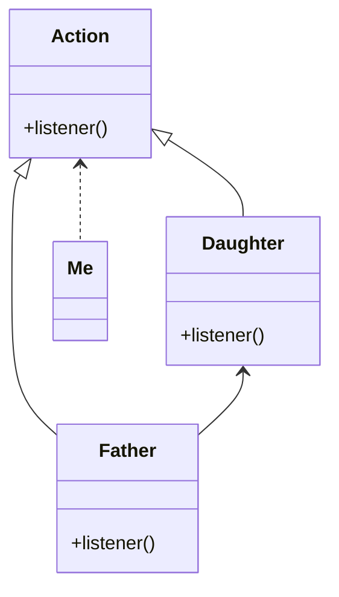

代理模式（也称为委托模式，在**Kotlin**中有一个关键词`by`就是委托属性，可以深入研究一下），是结构型设计模式之一。其主要功能是，能够通过代理类访问到无法访问的目标对象（这个是应用比较多的功能），或者通过代理类加工对目标对象的访问（这个功能是其次的，很多方法都可以做到）。他的结构如下：

对图中的几个类简单解释下：

- Me：在设计模式中是调用者的抽象；
- Action：是代理模式中，对代理类和真实类的抽象，可以是抽象类也可以是接口；
- Father：代理模式中的代理类，他不是具体执行行为的对象，而是把需要执行行为这一动作转发给真实类去执行
- Daughter：代理模式中的真实类，是整个模式中具体执行调用者逻辑的实现类。

通过一个简单的例子来表达的这几个类的关系：我需要告诉女朋友今晚买了票一起看电影，这个时候她在房间里，我没法进去就没法直接通知到她，而她爸爸正好在门口看书，如果关系和我还不错，在听到我说让我通知女朋友今晚看电影时，就朝屋子里的女朋友喊今晚我要和她看电影，这个时候女朋友也就听到了。在这个场景中，父亲和女儿是需要在同一个模块下才能通信的，并且父亲需要能通过喊话通知到女儿的能力（也就是必须持有**Daughter**类的实例），否则要是父亲是哑巴，那整个调用过程其实是不可行的。

代理模式分为**动态代理**和**静态代理**，这里的动静指的是是否是在运行时就已经确定了代理对象，一般情况下，静态代理由程序员直接编码就实现了，而动态代理则是程序在运行过程中才知道代理对象是谁。下面通过两个实例来解释。

静态代理的可以从`AIDL中的应用去理解，首先`AIDL`是一种接口定义语言，作用是协助开发者自动生成`Binder`通信需要的辅助类。

以下是一个`AIDL`使用过程中所涉及的几个核心的类的伪代码：

接下里讲讲辅助类的内容：

- 一个是`AIDL`中定义的接口的实现基类`Base`，这个`Base`继承自`Binder`并实现了`AIDL`的接口(假设接口是`aidl`)，它对外的身份就有两个：`Binder`和`aidl`。对客户端来说，能拿到的也是这两个身份，由于`aidl`是客户自己所设计的接口，不具备通用性，在框架设计上，传递的都是`Binder`对象。在使用时服务端就会把继承自`Base`的具体实现类`BaseImpl的实例以`Binder`对象的身份返回给客户端，客户端拿到后，因为是个`Binder`对象，没法直接使用`aidl`中定义的方法。
- 另一个`Proxy`类的作用就出现，在调用`asInterface`的方法中，实际会生成一个`Proxy`对象返回给客户端，`Proxy`根据上面的**UML**可以知道对应的是**Father**的角色，而服务端对应的就是**Daughter**的角色，他们都实现了`aidl`接口，并且`Proxy`中持有了`Binder`对象(实际就是服务端返给客户端的`BaseImpl`的实例)。此时，客户端调用`Proxy`，`Proxy`调用`BaseImpl`这样一个完整的通信链条就连接好了。

可能到这里，会觉得好像是把复杂的事情搞麻烦了，一开始我拿到`baseImpl`来个转换不就好了，对应简单场景这样用肯定没有问题，但设计模式就是用来解决通用性问题的。例如这次我是喊女朋友看电影，下次可能就是我在屋外放烟花，由于之前定义的行为中只有听的操作，你总不能让女朋友只听烟花的声音吧，那还不如拿个音响放放，这样你又需要定义一个看的行为的接口。所以为了解决这一类的问题，就有了`AIDL`这种设计，而它这里应用的就是静态代理模式，不让我们直接访问到`Binder`对象的细节，而是把一切都通过接口定义来实现，这就好比，如果每一次看电影，都需要我买好票，然后通知女朋友票买好，还要为她规划好出门的理由或者路线，那就太累了，要是我只负责买票和通知，然后只需要在影院门口等就轻松很多了，对于女朋友是找借口出门还是翻窗户出门我一点都不关心（现实中还是前者好点，不然会被打的）分清两个人的职责。对应面向接口编程，细节实现不应该是调用者关心的。

动态代理的应用在`Retrofit`中可谓是表现得淋漓尽致。想想刚刚静态代理的场景中，代理类是很核心的一个类，它完成了`Binder`和`aidl`两个类的动作转换，同时隐藏了`Binder`类（这种感觉突然有点像地下工作者哈哈，在外面的身份是特务，但是在交通站接收任务的时候又是友方人员，执行任务）。不过这个`Proxy`是先生成好的，我们在代码中才能调用，这样有个问题是它是固定的，也就是作为交通站，我知道我要代理谁，那万一出了叉子敌人不是把我们一锅端了，所以后来就改进了这个问题，我们不知道具体谁是那个卧底（代理对象），只知道他有个一个身份，叫胡峰同志，这样就不需要管具体接头做任务的是谁，只需要确定他是胡峰就可以了。而动态代理也差不多是这样的一个工作模式。动态代理伪代码如下：

在代码执行过程中，代理会通过实现接口，然后反射的形式来获取方法，最后调用`InvocationHandler`对象的`invoke`方法，我们只需要在这个`invoke`方法里实现具体的逻辑就行了。

接着看看`Retrofit`中的实现：

这个方法是创建`Retrofit`的`create`方法，传入的参数是我们自定义的网络接口。可以看到这个方法中返回的代理类是动态生成的，在我们具体调用`service`的某个方法时，代理类中会去执行`InvocationHandler`的`invoke`，来具体执行网络的请求，就这样我们仅需要做好定义网络接口这一件事，其他的工作都被自动执行了，不再需要维护各种各样的代理类、封装类，不仅仅是极大的简化了代码，更重要的是这种操作能规避很多危险，开发者能做的事情越少，对一个成熟的系统而言就是**越安全稳定**。